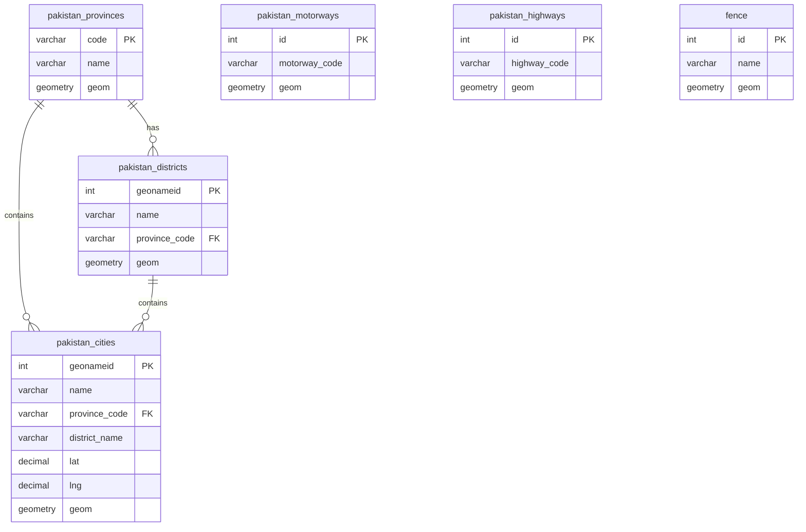
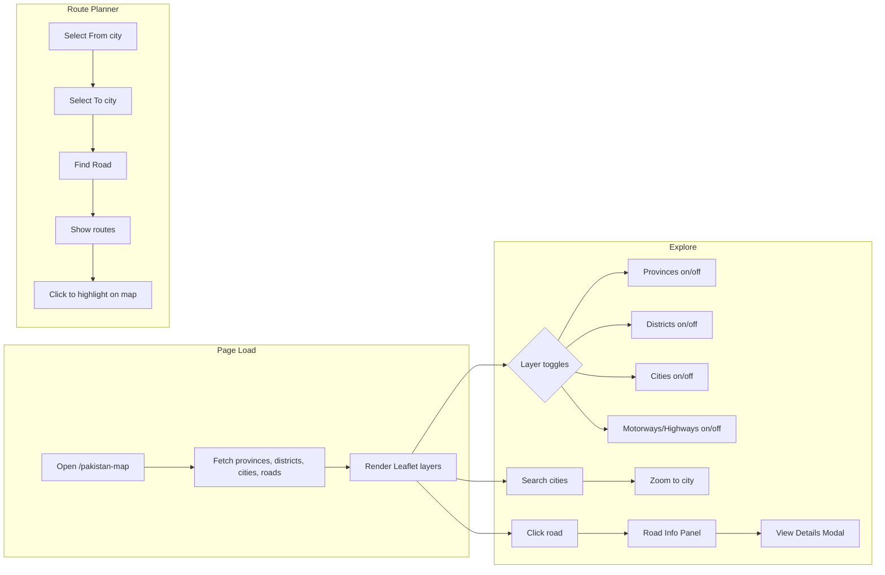
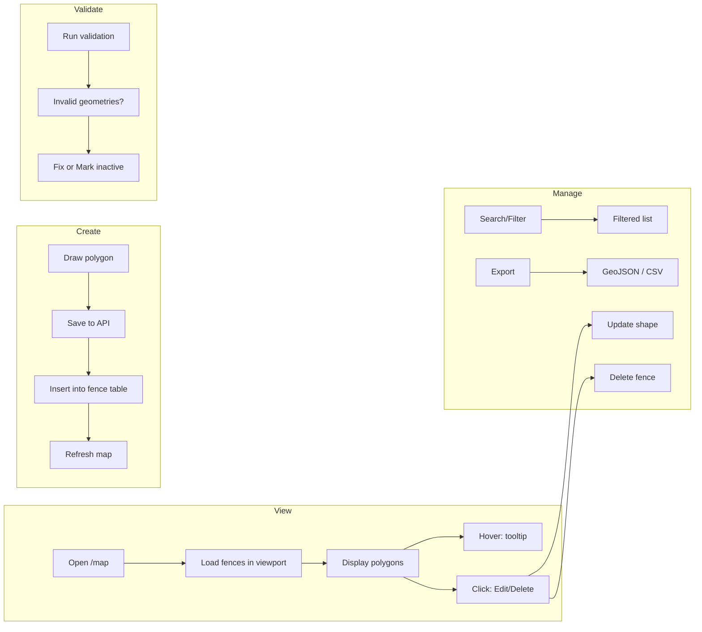
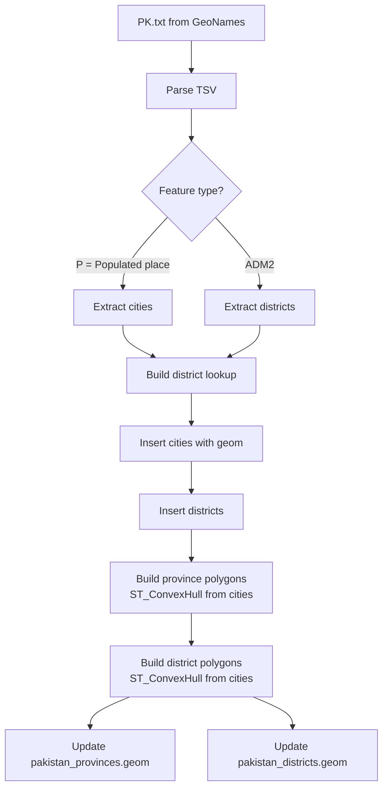

# Pakistan Map & Fences – Working Document

**System Overview | Data Sources | Tables | Visualization | Operations**

---

## 1. System Overview

This project provides two main map-based modules:

| Module | Route | Purpose |
|--------|-------|---------|
| **Fences Map** | `/map` | View, create, edit, and manage geographic fence polygons (zones) |
| **Pakistan Map** | `/pakistan-map` | Explore Pakistan: provinces, districts, cities, roads with interactive features |

Both use **PostgreSQL + PostGIS** for spatial data and **Next.js + Leaflet** for the frontend.

---

## 2. Data Sources & Downloads

### 2.1 Pakistan Administrative Data (Provinces, Districts, Cities)

#### Recommended: Better Data Sources (accurate coordinates)

| Source | Use For | Command | Notes |
|--------|---------|---------|-------|
| **GADM** (UC Davis) | Provinces, Districts | `npm run import:pakistan:boundaries` | Official boundaries, no download |
| **OpenStreetMap** | Cities/Places | `npm run import:pakistan:osm` | Accurate coordinates via Overpass API |
| **GeoNames** (with bbox filter) | Cities (fallback) | `npm run import:pakistan` | PK/PK1, points outside Pakistan excluded |

#### GeoNames (legacy, with bbox filter)

| Item | Source | Download / Location |
|------|--------|---------------------|
| **GeoNames Pakistan Dump** | [GeoNames](https://download.geonames.org/export/dump/) | `PK.zip` → extract to `PK/PK.txt` or `PK1/PK.txt` |
| **Direct link** | — | https://download.geonames.org/export/dump/PK.zip |
| **Format** | Tab-delimited UTF-8 | See `PK/readme.txt` for column definitions |
| **Bbox filter** | — | Points outside Pakistan (60.87–77.84°E, 23.69–37.08°N) are excluded |

**Columns used:** `geonameid`, `name`, `asciiname`, `alternatenames`, `latitude`, `longitude`, `feature_class`, `feature_code`, `admin1`, `admin2`, `population`, `elevation`.

### 2.2 Fences Data

| Item | Source | Download / Location |
|------|--------|---------------------|
| **Excel / CSV** | Internal / custom | `excel/fencedetail.xlsx` or `fencedetail.csv` |
| **Required columns** | — | `id` (polygon ID), `lon`/`lng`, `lat`, optional: `name`, `address`, `city`, `order` |
| **Format** | One row per polygon vertex | Multiple points with same `id` → one polygon per `id` |

**No external download.** Data is prepared in-house (Excel/CSV) and transformed into SQL.

### 2.3 Roads Data (Motorways, Highways)

| Item | Source | Download / Location |
|------|--------|---------------------|
| **Sample data** | Bundled SQL | `sql/roads_sample_data.sql` |
| **Schema** | — | `sql/roads_schema.sql` |
| **Load command** | — | `npm run setup:roads` |

Roads are seeded from bundled SQL. For more roads, add INSERTs to `roads_sample_data.sql` or import from external sources.

---

## 3. Database Tables & Insert Flow

### 3.1 Table Summary

```
┌─────────────────────────────────────────────────────────────────────────┐
│                         DATABASE TABLES                                  │
├─────────────────────────────────────────────────────────────────────────┤
│ PAKISTAN MODULE                                                          │
│   pakistan_provinces    → 7 provinces (seed + polygons from cities)      │
│   pakistan_districts    → ~150 districts (from GeoNames ADM2)            │
│   pakistan_cities       → ~230K cities/villages (from PK/PK1)            │
│   pakistan_motorways    → Motorways M-1, M-2, etc.                       │
│   pakistan_highways     → National highways N-5, N-25, etc.              │
│   pakistan_road_junctions → Junctions (optional)                         │
│   pakistan_intercity_roads → Intercity roads (optional)                  │
├─────────────────────────────────────────────────────────────────────────┤
│ FENCES MODULE                                                            │
│   fence (or cherat_fences) → Polygon zones from Excel/CSV transform      │
└─────────────────────────────────────────────────────────────────────────┘
```

### 3.2 What Gets Inserted Where

| Table | Data Source | Insert Method | Key Columns |
|-------|-------------|---------------|-------------|
| `pakistan_provinces` | SQL seed | `setup_pakistan_geo.sql` | code, name, geom (updated by import) |
| `pakistan_districts` | PK/PK1 (ADM2) | `import-pakistan-data.mjs` | geonameid, name, province_code, geom |
| `pakistan_cities` | PK/PK1 (feature_class P) | `import-pakistan-data.mjs` | geonameid, name, lat, lng, province_code, geom |
| `pakistan_motorways` | roads_sample_data.sql | `setup-roads-db.mjs` | motorway_code, name, geom |
| `pakistan_highways` | roads_sample_data.sql | `setup-roads-db.mjs` | highway_code, name, geom |
| `fence` | fencedetail.xlsx/csv | `transform-excel-to-fences.mjs` → SQL → psql | id, name, geom |

### 3.3 Table Schemas (Key Columns)

**pakistan_provinces**
- `code`, `name`, `name_urdu`, `geom` (POLYGON), `area_sqkm`, `population`, `capital_city`

**pakistan_districts**
- `geonameid`, `name`, `province_code` (FK → provinces), `geom` (POLYGON)

**pakistan_cities**
- `geonameid`, `name`, `name_alternate`, `province_code`, `district_name`, `latitude`, `longitude`, `population`, `geom` (POINT)

**pakistan_motorways**
- `motorway_code`, `name`, `start_city`, `end_city`, `length_km`, `lanes`, `geom` (LINESTRING)

**pakistan_highways**
- `highway_code`, `name`, `start_city`, `end_city`, `length_km`, `geom` (LINESTRING)

**fence**
- `id`, `name`, `address`, `city`, `geom` (POLYGON/MultiPolygon), optionally `status`

---

## 4. Data Visualization

### 4.1 Pakistan Map (`/pakistan-map`)

| Layer | Visualization | Source |
|-------|---------------|--------|
| Provinces | Colored polygons | `pakistan_provinces` |
| Districts | Polygons (toggle) | `pakistan_districts` |
| Cities | Circle markers (size ∝ population) | `pakistan_cities` |
| Motorways | Green lines (4px) | `pakistan_motorways` |
| Highways | Blue lines (3px) | `pakistan_highways` |

**Interactions:**
- Click province → filter districts/cities
- Search cities → zoom to result
- Click road → Road Info Panel, details modal
- Road search (M-2, N-5, etc.)
- Route planner (find road between two cities)
- Hover tooltips on roads

### 4.2 Fences Map (`/map`)

| Element | Visualization | Source |
|---------|---------------|--------|
| Fences | Colored polygons (by region/status) | `fence` table |
| New fence | Draw polygon with Leaflet.Draw | — |

**Interactions:**
- Draw new polygon → save to DB
- Click fence → Edit / Delete
- Search by name, region, status
- Filter by area (min/max)
- Export GeoJSON/CSV
- Validation: fix invalid geometries, mark inactive

---

## 5. Operations & Workflows

### 5.1 Initial Setup (One-Time)

```
1. PostgreSQL + PostGIS installed
2. Create DB, run: psql -d <db> -f sql/setup_pakistan_geo.sql
3. (Optional) npm run setup:roads
4. .env.local configured (DB_HOST, DB_PORT, DB_NAME, DB_USER, DB_PASSWORD)
```

### 5.2 Pakistan Data Import (Recommended Flow)

**Option A – Best accuracy (GADM + OSM):**
```
1. npm run setup:pakistan          # Create tables
2. npm run import:pakistan:boundaries   # GADM provinces & districts (accurate boundaries)
3. npm run import:pakistan:osm     # OSM cities (accurate coordinates)
```

**Option B – GeoNames with bbox filter (max coverage):**
```
1. Download PK.zip from GeoNames → extract to PK/PK.txt or PK1/PK.txt
2. npm run import:pakistan         # Imports only points inside Pakistan bbox
3. (Optional) npm run import:pakistan:boundaries   # Override with GADM boundaries
```

### 5.3 Fences Import

```
1. Prepare Excel/CSV: id, lon, lat, (name, address, city, order)
2. Place: excel/fencedetail.xlsx or fencedetail.csv
3. Run: npm run transform:fences
4. Output: scripts/output/fences.sql
5. Run SQL: psql -d <db> -f scripts/output/fences.sql
   (or set TRANSFORM_RUN_SQL=1 to run automatically)
```

### 5.4 API Operations

| API | Method | Purpose |
|-----|--------|---------|
| `/api/fences` | GET | List fences (bbox, search, filters) |
| `/api/fences` | POST | Create new fence |
| `/api/fences/[id]` | GET/PUT/DELETE | Read, update, delete fence |
| `/api/fences/export` | GET | Export GeoJSON or CSV |
| `/api/fences/stats` | GET | Fence statistics |
| `/api/fences/validate` | GET | Check geometry validity |
| `/api/pakistan/provinces` | GET | GeoJSON provinces |
| `/api/pakistan/districts` | GET | GeoJSON districts (?province=04) |
| `/api/pakistan/cities` | GET | GeoJSON cities (?search=, ?province=) |
| `/api/pakistan/motorways` | GET | GeoJSON motorways |
| `/api/pakistan/highways` | GET | GeoJSON highways |
| `/api/pakistan/roads/search` | GET | Search roads by name/code |
| `/api/pakistan/roads/between` | GET | Roads between two cities |

---

## 6. Mermaid Diagrams

Copy the code blocks below into [Mermaid Live Editor](https://mermaid.live) or any Mermaid-supported tool to generate professional diagrams.

### 6.1 System Architecture & Data Flow

```mermaid
flowchart TB
    subgraph Sources["Data Sources"]
        PK[PK/PK1 PK.txt<br/>GeoNames]
        Excel[fencedetail.xlsx<br/>or CSV]
        RoadSQL[roads_sample_data.sql]
    end

    subgraph Scripts["Import/Transform Scripts"]
        Import[npm run import:pakistan]
        Transform[npm run transform:fences]
        SetupRoads[npm run setup:roads]
    end

    subgraph DB[(PostgreSQL + PostGIS)]
        Provinces[pakistan_provinces]
        Districts[pakistan_districts]
        Cities[pakistan_cities]
        Motorways[pakistan_motorways]
        Highways[pakistan_highways]
        Fence[fence]
    end

    subgraph API["Next.js API Routes"]
        FenceAPI[/api/fences]
        PakAPI[/api/pakistan/*]
    end

    subgraph Frontend["Frontend (Leaflet)"]
        MapPage["/map<br/>Fences Map"]
        PakMap["/pakistan-map<br/>Pakistan Map"]
    end

    PK --> Import
    Import --> Provinces
    Import --> Districts
    Import --> Cities
    Excel --> Transform
    Transform --> Fence
    RoadSQL --> SetupRoads
    SetupRoads --> Motorways
    SetupRoads --> Highways

    Provinces --> PakAPI
    Districts --> PakAPI
    Cities --> PakAPI
    Motorways --> PakAPI
    Highways --> PakAPI
    Fence --> FenceAPI

    PakAPI --> PakMap
    FenceAPI --> MapPage
```

### 6.2 Database Entity Relationship



### 6.3 User Operations Flow (Pakistan Map)



### 6.4 User Operations Flow (Fences Map)



### 6.5 Pakistan Data Import Pipeline



---

## 7. Quick Reference

| Task | Command |
|------|---------|
| Setup Pakistan tables | `psql -d <db> -f sql/setup_pakistan_geo.sql` |
| Import cities/districts | `npm run import:pakistan` |
| Setup roads | `npm run setup:roads` |
| Transform fences Excel→SQL | `npm run transform:fences` |
| Run app | `npm run dev` |

| Page | URL |
|------|-----|
| Fences Map | http://localhost:3000/map |
| Pakistan Map | http://localhost:3000/pakistan-map |
| Pakistan Dashboard | http://localhost:3000/pakistan-dashboard |

---

---

## 8. Related Files

- **Mermaid diagrams (copy-paste for professional export):** `docs/MERMAID_DIAGRAMS.md`
- **Pakistan setup:** `README_PAKISTAN_MAP.md`
- **Roads:** `ROADS_README.md`

*Document Version: 1.0 | Last Updated: Jan 2025*
