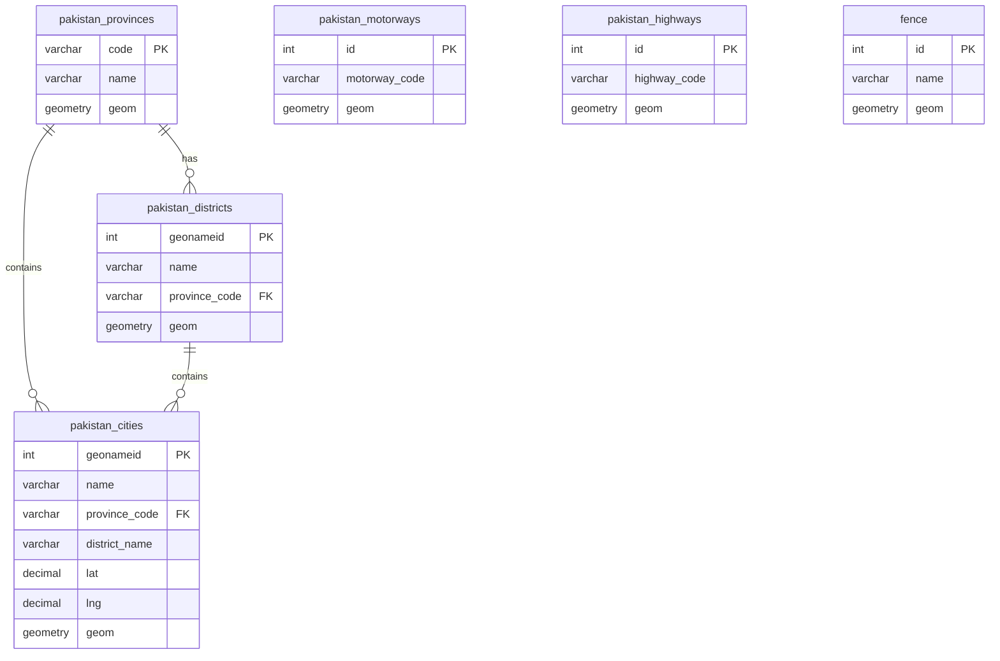
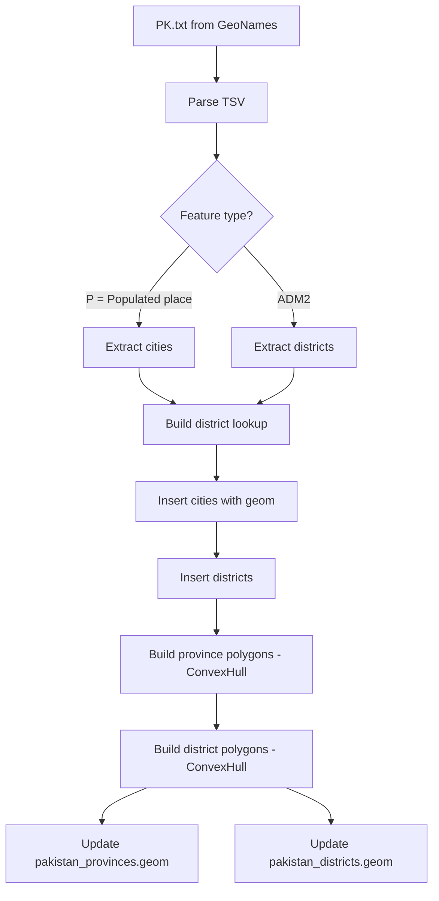
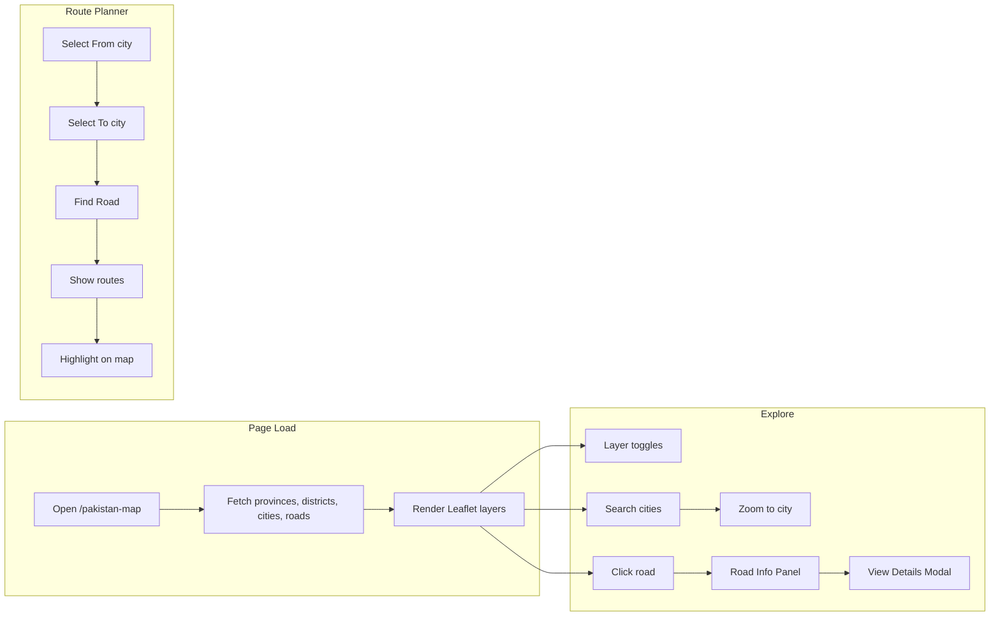
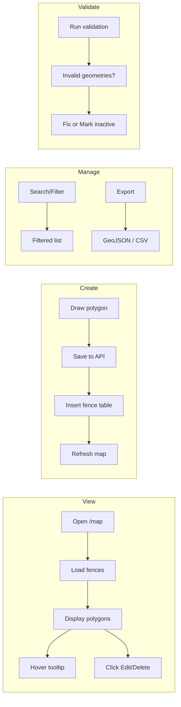
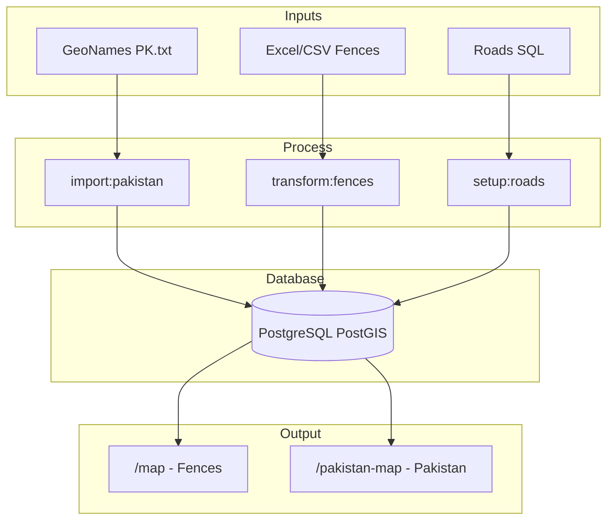

# Mermaid Diagrams – Pakistan Map & Fences

Copy each code block into [Mermaid Live Editor](https://mermaid.live) to generate professional diagrams (PNG, SVG, or export).

---

## 1. System Architecture & Data Flow

```mermaid
flowchart TB
    subgraph Sources["Data Sources"]
        PK[PK/PK1 PK.txt - GeoNames]
        Excel[fencedetail.xlsx or CSV]
        RoadSQL[roads_sample_data.sql]
    end

    subgraph Scripts["Import/Transform Scripts"]
        Import[npm run import:pakistan]
        Transform[npm run transform:fences]
        SetupRoads[npm run setup:roads]
    end

    subgraph DB[(PostgreSQL + PostGIS)]
        Provinces[pakistan_provinces]
        Districts[pakistan_districts]
        Cities[pakistan_cities]
        Motorways[pakistan_motorways]
        Highways[pakistan_highways]
        Fence[fence]
    end

    subgraph API["Next.js API Routes"]
        FenceAPI[/api/fences]
        PakAPI[/api/pakistan/*]
    end

    subgraph Frontend["Frontend - Leaflet"]
        MapPage["/map - Fences Map"]
        PakMap["/pakistan-map - Pakistan Map"]
    end

    PK --> Import
    Import --> Provinces
    Import --> Districts
    Import --> Cities
    Excel --> Transform
    Transform --> Fence
    RoadSQL --> SetupRoads
    SetupRoads --> Motorways
    SetupRoads --> Highways

    Provinces --> PakAPI
    Districts --> PakAPI
    Cities --> PakAPI
    Motorways --> PakAPI
    Highways --> PakAPI
    Fence --> FenceAPI

    PakAPI --> PakMap
    FenceAPI --> MapPage
```

---

## 2. Database Entity Relationship



---

## 3. Pakistan Data Import Pipeline



---

## 4. Pakistan Map – User Operations



---

## 5. Fences Map – User Operations



---

## 6. Full System Overview (Simplified)



---

**Usage:** Paste any block (without the triple backticks) into https://mermaid.live and export as PNG or SVG for presentations or docs.
